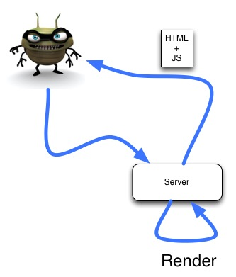
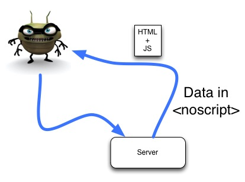
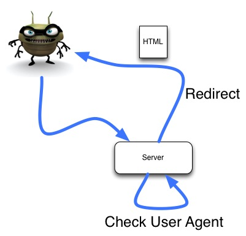
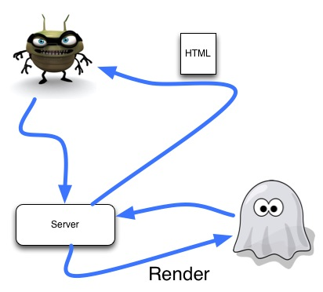
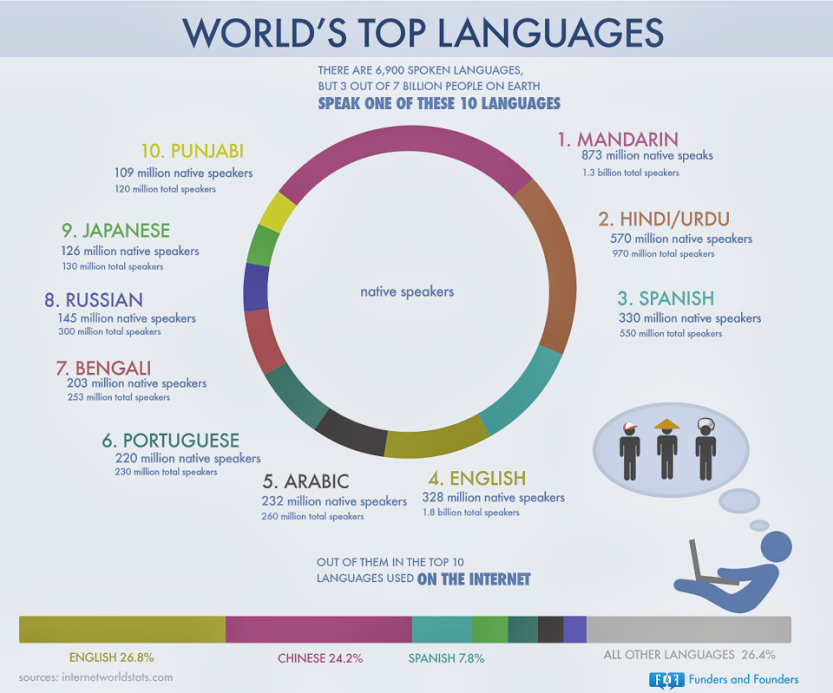

# SEO & i18n

---

## Our Presenters

## David Luecke

* GitHub: [daffl.github.com](http://daffl.github.com), Twitter: [@daffl](http://twitter.com/daffl)

## Eric Kryski

* GitHub: [ekryski.github.com](http://ekryski.github.com), Twitter: [@ekryski](http://twitter.com/ekryski)

---

## Our Sponsors

## Assembly Co-working Space

## PetroFeed

---

## Our Sponsors

## Village Brewery

---

## Last Month

# [Module Loading & Generators](http://yycjs.com/module-loading-generators/#slide1)

- Modules
    - Module Types (CommonJS, AMD, ES6)
    - RequireJS
    - Component
    - Browserify
- Generators
    - Yeoman
    - Mimosa

---

# SEO

---

## Search Engine Optimzation

---

## Different Strokes

Different search engines archive and rank differently and...

It's constantly evolving!

---

## Typical SEO Protips

- Need a good title description
- Get links back from large reputable sources
- Have a clean link structure
- Fill in `` alt text, `<a>` title text, `<meta>` tags
- Have rich diverse content. Excessive repitition == bad. No content == bad.
- Don't abuse keywors. Use nice phrases.
- Spit your message different ways on different pages
- Leverage social media
- Put in an XML Sitemap
- Get Traffic!!

---

## Google Hummingbird Algorithm

* Natural Language
* Big Overhaul

---

## Great. What about JS apps?

Crawlers don't do JS... [or do they](http://moz.com/ugc/can-google-really-access-content-in-javascript-really)?

---

## Pre-rendering

Pre-render server side.

---

## Hybrid Solutions

Having some content static and some content dynamic.

Utilizing `<noscript>` tags.

---

## Separate robots site

Generate a completely separate site just for robots.

---

## Snapshotting

Render out site in HTML using Phantom for specific URL params and/or user agent.

---

# i18n

---

## Why do I care?

I'm not big and global so...

---

## Maybe you should give at least one

---

## Services

- Translation companies
- Your amazing multi-lingual team
- Google translate
- [Crowd sourcing](http://www.shopify.ca/blog/3027032-crowdsourcing-internationalization#axzz2fyZd1aiW)

---

## i18n Domain Tips

- Set your `lang` attribute
- Prevent robots from crawling your site in multiple languages
- Use internationalized domain names (IDN)

---

## i18n URLs

* `site.com?loc=de` - Nope
* `example.com/de/` - Good
* `de.example.com` - Better
* `example.ie` - Best

---

## Client Side Tools

- [Jed](http://slexaxton.github.io/Jed/)
- [i18next](http://i18next.com/)
- [Globalize](https://github.com/jquery/globalize)
- [moment](http://momentjs.com/)

---

## Jed

---

## Jed for AMD

    !javascript
    require(['jed'], function ( Jed ) {
      var i18n = new Jed({
        // Generally output by a .po file conversion
        locale_data : {
          "messages" : {
            "" : {
              "domain" : "messages",
              "lang"   : "en",
              "plural_forms" : "nplurals=2; plural=(n != 1);"
            },
            "some key" : [ null, "some value"]
          }
        },
        "domain" : "messages"
      });

      alert( i18n.gettext( "some key" ) ); // alerts "some value"
    });

---

## Server Side Tools

- [Jed](http://slexaxton.github.io/Jed/)
- [i18n-abide](https://github.com/mozilla/i18n-abide)
- [i18next-node](https://github.com/jamuhl/i18next-node)
- [i18n-2](https://github.com/jeresig/i18n-node-2)
- [i18n-node](https://github.com/mashpie/i18n-node)
- [node-polyglot](https://github.com/airbnb/polyglot.js)

---

## Jed for NodeJS

    !javascript
      var Jed = require('Jed');
      var i18n = new Jed({
        // Generally output by a .po file conversion
        locale_data : {
          "messages" : {
            "" : {
              "domain" : "messages",
              "lang"   : "en",
              "plural_forms" : "nplurals=2; plural=(n != 1);"
            },
            "some key" : [ null, "some value"]
          }
        },
        "domain" : "messages"
      });

      console.log( i18n.gettext( "some key" ) ); // logs "some value"
    });

---

## FeathersJS

---

## [Next Month](http://www.meetup.com/YYC-js/events/131079442/)

- Why are most mobile web apps slow?
- Good mobile tools
    - Bootstrap 3
    - Ratchet
    - Topcoat
    - Zepto/custom lodash
- Mobile web pro-tips
- Building a simple snappy mobile app